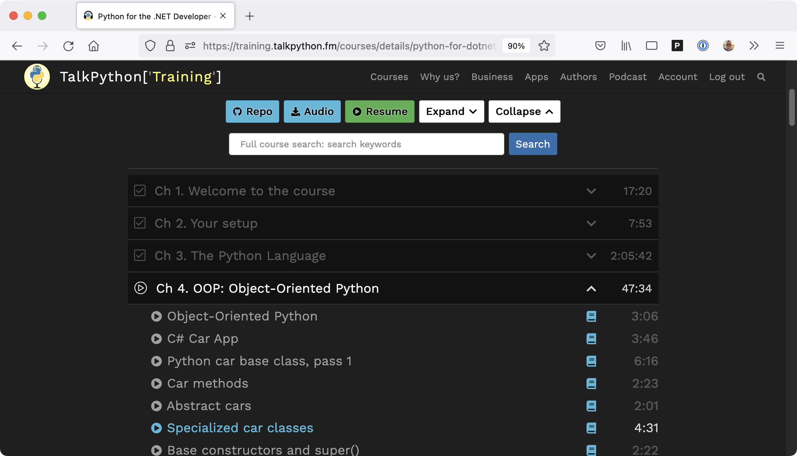
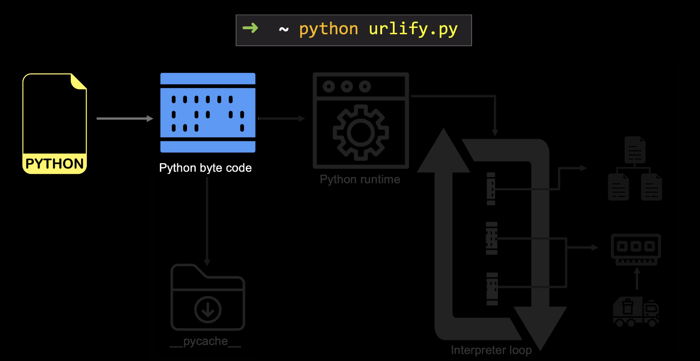
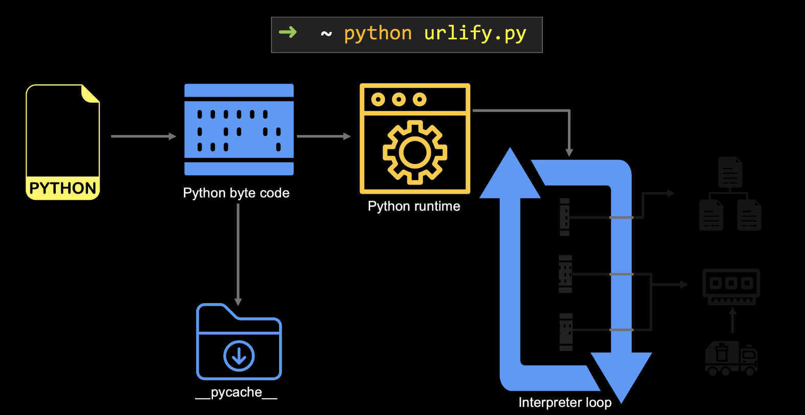
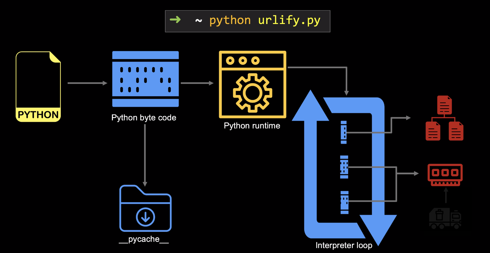
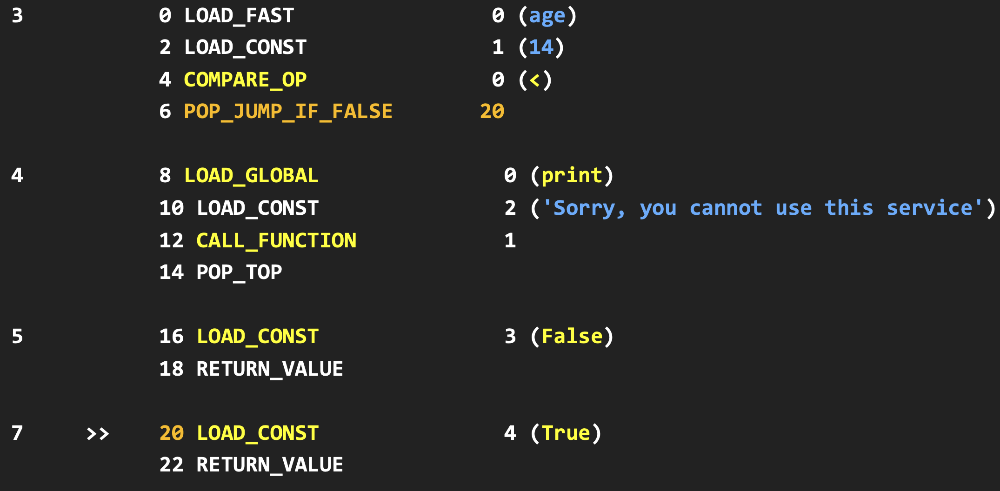
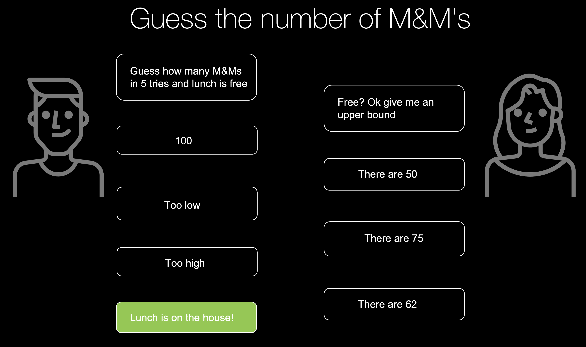
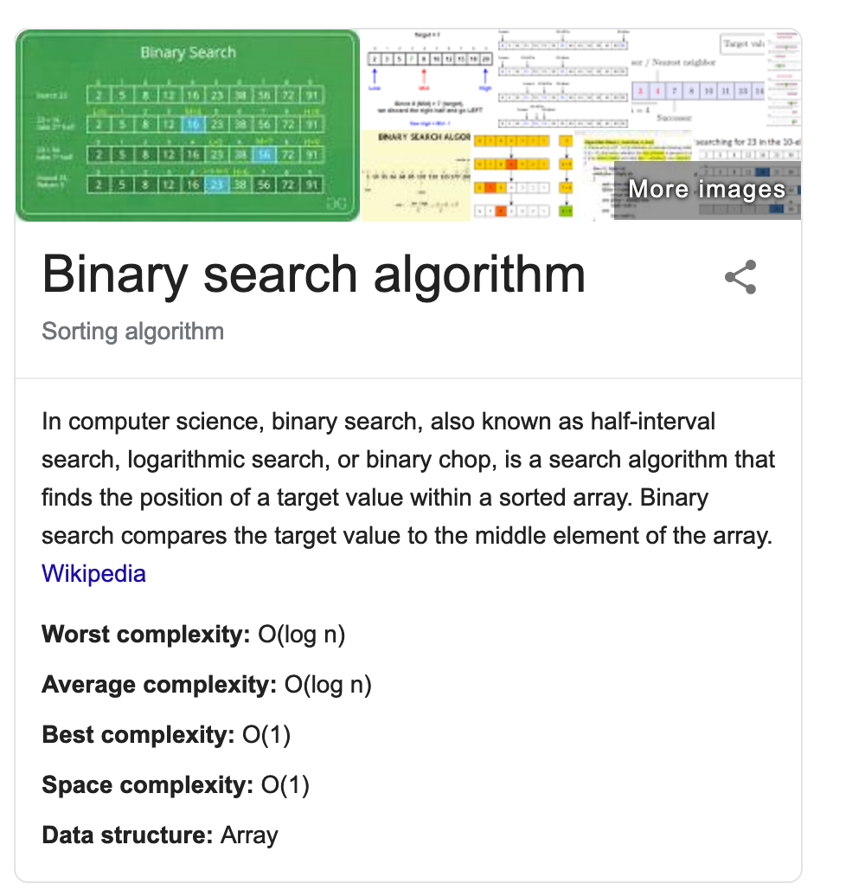

# Gallery: Chapter 03 - The Big Ideas of Software Development

Figure 1: [Source code is used to make decisions about how data is displayed](figures/0302-webapp.png)

Figure 2: [Example of source code executing (as a Python app)](figures/0304-code_execution.png)

Figure 3: [Code Execution: Start with Python source code](figures/0305-code_execution_1.png)

Figure 4: [Code Execution: Python converts this to Python Byte Code](figures/0305-code_execution_2.png)

Figure 5: [Code Execution: Byte code is cached for reuse](figures/0305-code_execution_3.png)

Figure 6: [Code Execution: Byte code is passed to the Python runtime](figures/0305-code_execution_4.png)

Figure 7: [Code Execution: Python's interpret loop processes the byte code](figures/0305-code_execution_5.png)

Figure 8: [Code Execution: Python interprets the byte code one by one](figures/0305-code_execution_9.png)

Figure 9: [Code Execution: Byte code contains comamands (a file operation)](figures/0305-code_execution_6.png)

Figure 10: [Code Execution: Byte code contains comamands (reading from RAM)](figures/0305-code_execution_7.png)

Figure 11: [Code Execution: The runtime manages memory usage for us](figures/0305-code_execution_8.png)

Figure 12: [Code Execution: Example of raw Python byte code](figures/0306-byte_code.png)

Figure 13: [Algorithms are just structured decisions and actions](figures/0307-algorithm.png)

Figure 14: [The first part of our guessing algorithm](figures/0308-guess_1.png)

Figure 15: [Our guessing algorithm wins us a free lunch](figures/0308-guess_2.png)

Figure 16: [Binary search algorithm](figures/0309-binary_search.png)

Figure 17: [Many similarities and differences between pros and beginners](figures/0310-pros_vs_beginners.jpg)

Figure 18: [The beginners and experts episode on Talk Python To Me](figures/0311-podcast.png)

